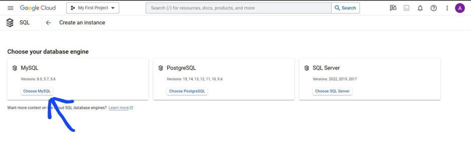
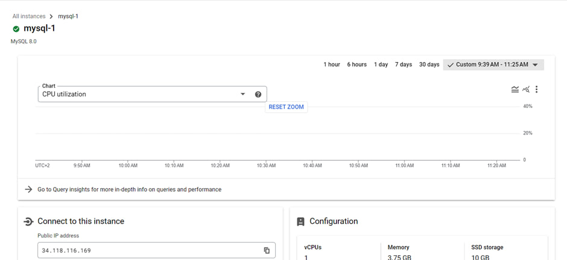
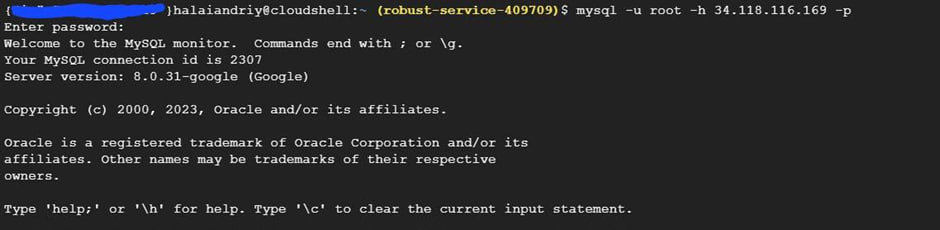
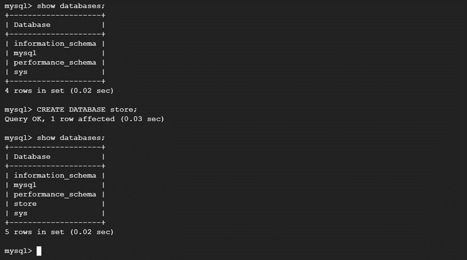
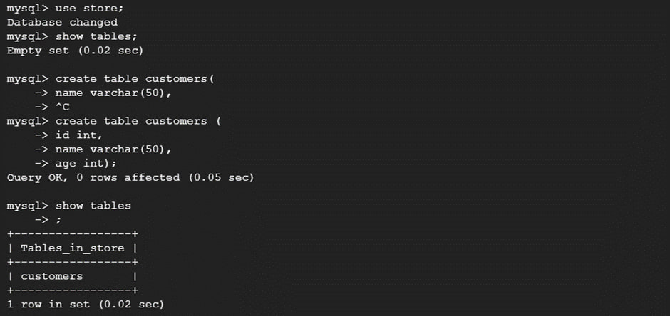
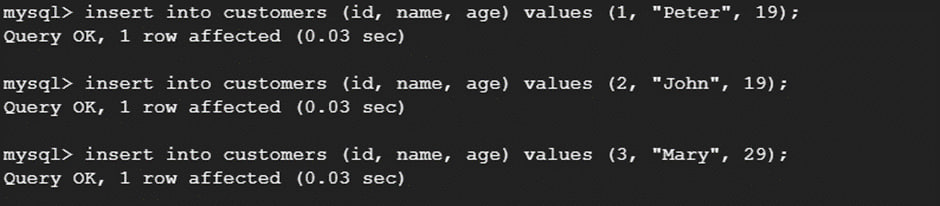
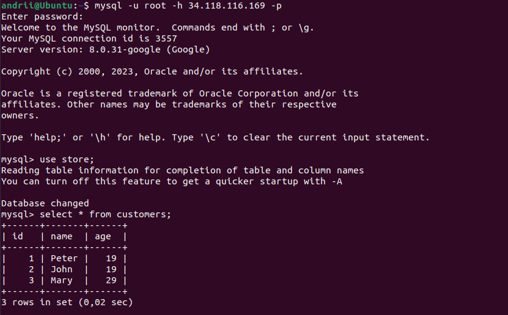
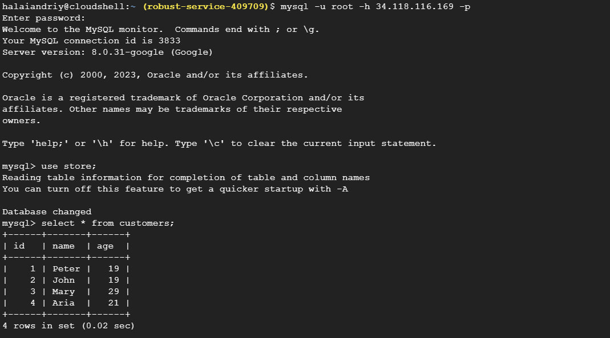

**Виконали:** 
*студенти 2-го курсу, групи ІМ-21:* 

 **Галай Андрій** [Пошта: halaiandriy@gmail.com]

 **Дворецька Анастасія** [Пошта: nastyadvoretskaya2005@gmail.com]

**Керівник**

*доцент кафедри ОТ ФІОТ, к.т.н., доцент* **Андрій БОЛДАК** 

[НТУУ "КИЇВСЬКИЙ ПОЛІТЕХНІЧНИЙ ІНСТИТУТ імені ІГОРЯ СІКОРСЬКОГО](https://kpi.ua/)

[Факультет інформатики та обчислювальної техніки](https://fiot.kpi.ua/)

[Кафедра обчислювальної техніки](https://comsys.kpi.ua/)

Київ

# Переваги використання хмарних баз даних

ВСТУП

## Створення хмарної бази даних використовуючи платформу Google Cloud

Для початку потрібно пройти рєстрацію. Далі обираємо бажану СУБД і налаштовуємо рушія:

Виконавши всі налаштування, можемо побачити, що наше хмарне сховище було створено:

Тепер створимо базу даних та протестуємо її роботу. Для простоти підключимося до хмарного сховища використовуючи термінал:

Створимо нову базу даних із назвою “store”:

Тепер створимо нову таблицю та внесемо до неї дані:

Дані було збережено у хмарній базі даних.
Тепер спробуємо підключитися та дістати дані використовуючи інший пристрій:

Дані були успішно дістані з бази даних. Зробимо новий запис у таблиці:

Тепер перевіримо чи видно зміни з пристрою, який ми використовували до цього:

Дані є, а отже все працює правильно.

## Висновок

Отже, хмарні бази даних досить гнучкі та масштабовані, це дозволяє ефективно пристосовувати витрати ресурсів до потреб бізнесу. Забезпечуючи високу доступність та автоматизоване резервне копіювання даних, вони гарантують надійність та знижують ризик втрати інформації. Крім того, хмарні бази даних можна використовувати з будь-якого місця, де є підключення до інтернету.
